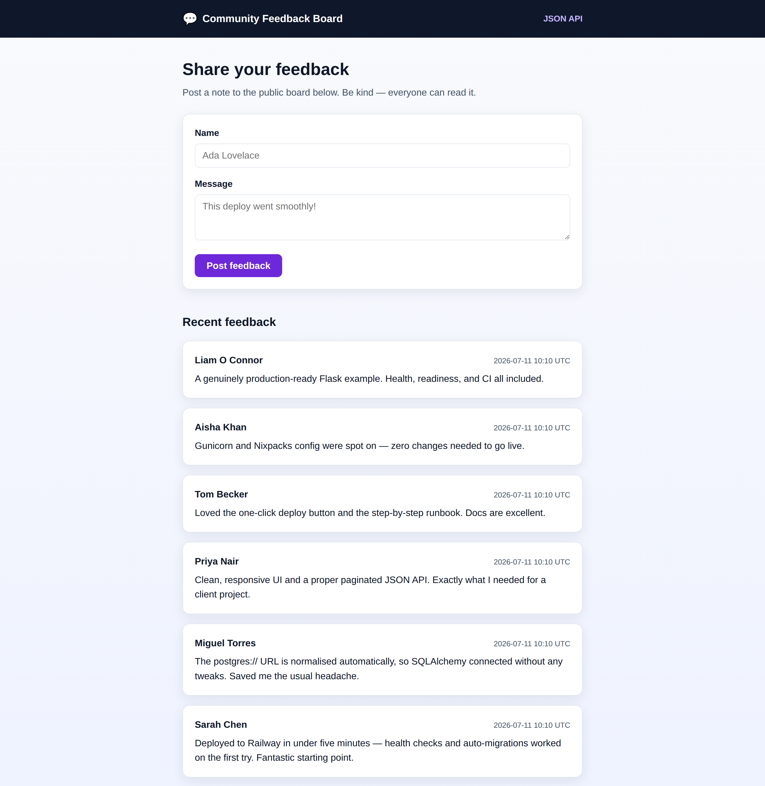

# Flask on Railway — Community Feedback Board

[](https://www.python.org/)
[](https://flask.palletsprojects.com/)
[](https://www.postgresql.org/)
[](https://railway.app/)
[](https://github.com/mooceanstudio/flask-railway-deploy/actions/workflows/ci.yml)
[](LICENSE)

A small but **production-ready** Flask web application, pre-configured for a smooth,
one-command deployment to **[Railway.app](https://railway.app/)**. It is a public
feedback / guestbook board: visitors post a name and a message, browse a paginated
list, and the same data is exposed through a clean JSON REST API.

The app is deliberately compact so the deployment story stays front and centre:
application factory + blueprints, SQLAlchemy 2.x models, Alembic migrations that
run automatically on every deploy, gunicorn, health/readiness probes, a Postgres/SQLite
`DATABASE_URL` that is normalized for you, a Dockerfile alternative, and a full test
suite that includes a real headless-browser Selenium end-to-end test.

<p align="center">
  <a href="https://railway.app/new"></a>
</p>



> The screenshot above is the actual app running (gunicorn). On Railway it runs
> identically against managed PostgreSQL.

---

## What it does

- **Post feedback** through a clean, responsive server-rendered form.
- **Browse feedback** on a paginated board, newest first.
- **JSON REST API** for the same data (`GET`/`POST /api/feedback`) with pagination and validation.
- **Health checks** at `/health` (liveness) and `/ready` (DB readiness) for the platform.
- **Automatic migrations** on deploy, so a fresh Railway PostgreSQL database is schema-ready on first boot.

```
 ┌───────────────────────────────────────────────────────────┐
 │  💬  Community Feedback Board                    JSON API   │
 ├───────────────────────────────────────────────────────────┤
 │  Share your feedback                                       │
 │  Post a note to the public board below.                    │
 │                                                            │
 │  Name     [ Ada Lovelace................................ ] │
 │  Message  [ This deploy went smoothly!.................. ] │
 │           [ Post feedback ]                                │
 │                                                            │
 │  Recent feedback                                           │
 │  ┌───────────────────────────────────────────────────────┐│
 │  │ Ada Lovelace                    2026-07-07 12:04 UTC   ││
 │  │ This deploy went smoothly!                             ││
 │  └───────────────────────────────────────────────────────┘│
 │  ┌───────────────────────────────────────────────────────┐│
 │  │ Grace Hopper                    2026-07-07 11:58 UTC   ││
 │  │ Love the auto-migrations.                             ││
 │  └───────────────────────────────────────────────────────┘│
 │           ← Newer      Page 1 of 3      Older →           │
 └───────────────────────────────────────────────────────────┘
```

---

## Tech stack

| Layer         | Choice                                             |
| ------------- | -------------------------------------------------- |
| Language      | Python 3.12                                        |
| Web framework | Flask 3 (application-factory + blueprints)         |
| ORM           | SQLAlchemy 2.x (typed `Mapped[...]` models)        |
| Migrations    | Flask-Migrate / Alembic                            |
| Database      | PostgreSQL (production), SQLite (local dev)         |
| Server        | gunicorn                                            |
| Platform      | Railway.app (Nixpacks **or** Docker)               |
| Tests         | pytest + Selenium 4 (headless Chrome E2E)          |
| CI            | GitHub Actions (SQLite, PostgreSQL, and Selenium)  |

---

## Local development quickstart

```bash
# 1. Clone and enter the project
git clone https://github.com/mooceanstudio/flask-railway-deploy.git
cd flask-railway-deploy

# 2. Create and activate a virtual environment
python3.12 -m venv .venv
source .venv/bin/activate            # Windows: .venv\Scripts\activate

# 3. Install dependencies (runtime + dev/test)
pip install -r requirements.txt -r requirements-dev.txt

# 4. Configure environment
cp .env.example .env                 # then edit SECRET_KEY, etc.
export FLASK_APP=app:create_app      # already set in .env; export for the CLI

# 5. Create the database schema
flask db upgrade                     # applies migrations to a local SQLite file

# 6. Run the development server
flask run                            # http://127.0.0.1:5000

# 7. Run the tests
pytest
```

Prefer a production-like run locally?

```bash
gunicorn "app:create_app()" --bind 0.0.0.0:8000
curl localhost:8000/health           # {"status":"ok"}
```

---

## Environment variables

Every variable is documented in [`.env.example`](.env.example).

| Variable          | Required            | Default                | Description                                                                 |
| ----------------- | ------------------- | ---------------------- | --------------------------------------------------------------------------- |
| `SECRET_KEY`      | **Yes (prod)**      | insecure dev fallback  | Signs sessions and flash messages. Generate a long random value.            |
| `DATABASE_URL`    | **Yes (prod)**      | local SQLite file      | SQLAlchemy/Postgres URL. `postgres://` is auto-rewritten (see below).       |
| `FLASK_ENV`       | No                  | `development`          | Selects the config class: `development` / `production` / `testing`.         |
| `APP_SETTINGS`    | No                  | —                      | Alternative to `FLASK_ENV`; takes precedence if set.                        |
| `FLASK_APP`       | No                  | `app:create_app`       | Entry point for the `flask` CLI (used by `flask db upgrade`).               |
| `PORT`            | No (injected)       | `8000`                 | Port the server binds to. **Railway injects this — never hardcode it.**     |
| `WEB_CONCURRENCY` | No                  | `2`                    | Number of gunicorn worker processes.                                        |

---

## 🚂 Deploy to Railway

This is the flagship section. Two supported paths are documented: the **dashboard**
(GitHub-connected) and the **Railway CLI**. Both rely on the same repo config.

### Why this repo "just works" on Railway

Three details trip up most Flask-on-Railway deploys. All three are handled here:

1. **Bind `0.0.0.0` and `$PORT`.** Railway assigns a random port via `$PORT` and routes
   external traffic to it. The app must listen on `0.0.0.0:$PORT`, never `127.0.0.1` or a
   hardcoded port. See [`start.sh`](start.sh) and the [`Procfile`](Procfile).
2. **Rewrite `postgres://` → `postgresql://`.** Railway's PostgreSQL plugin exposes
   `DATABASE_URL` with the legacy `postgres://` scheme, which SQLAlchemy no longer accepts.
   [`app/config.py`](app/config.py) normalizes it to `postgresql+psycopg2://` before
   SQLAlchemy ever sees it.
3. **Run migrations on deploy.** [`start.sh`](start.sh) runs `flask db upgrade` before
   gunicorn boots, so a brand-new database is schema-ready on the very first deploy — no
   manual step.

### Path A — Railway dashboard + GitHub

1. **Push this repo to GitHub** (already done if you cloned it).
2. In the [Railway dashboard](https://railway.app/dashboard), click **New Project →
   Deploy from GitHub repo** and pick `flask-railway-deploy`. Railway auto-detects the
   Python app via **Nixpacks** and reads [`railway.json`](railway.json).
3. **Add a database:** in the project, click **New → Database → Add PostgreSQL**. Railway
   provisions Postgres and exposes its connection string as `DATABASE_URL`.
4. **Wire the database into the web service.** Open the web service → **Variables** →
   **New Variable → Add Reference** and set:

   ```
   DATABASE_URL = ${{ Postgres.DATABASE_URL }}
   ```

5. **Set the remaining variables** on the web service:

   ```
   SECRET_KEY   = <paste: python -c "import secrets; print(secrets.token_hex(32))">
   APP_SETTINGS = production
   ```

   (`PORT` is injected automatically — do not set it. `WEB_CONCURRENCY` is optional.)
6. **Deploy.** Railway builds the image and runs the start command from `railway.json`
   (`./start.sh`), which applies migrations and then launches gunicorn.
7. **Health check.** `railway.json` sets `healthcheckPath` to `/health`; Railway waits
   for a `200` there before routing traffic and marking the deploy healthy.
8. **Generate a public URL.** Web service → **Settings → Networking → Generate Domain**.
   Visit it and post some feedback.

### Path B — Railway CLI

```bash
# 1. Install and log in
npm i -g @railway/cli
railway login

# 2. Create a project and link this directory
railway init                       # creates the project
railway link                       # link the local repo to it

# 3. Add a PostgreSQL database
railway add --database postgres

# 4. Set environment variables
railway variables --set "SECRET_KEY=$(python -c 'import secrets; print(secrets.token_hex(32))')" \
                   --set "APP_SETTINGS=production"
#   DATABASE_URL is injected automatically by the Postgres plugin.

# 5. Deploy the current directory
railway up

# 6. Watch the logs (you'll see `flask db upgrade` then gunicorn boot)
railway logs

# 7. Expose it and open in the browser
railway domain
```

### Migrations on deploy

`start.sh` runs `flask db upgrade` every deploy. To run it manually against the live
database:

```bash
railway run flask db upgrade
```

### Custom domain

Web service → **Settings → Networking → Custom Domain**, enter your domain, and add the
displayed `CNAME` record at your DNS provider. Railway provisions TLS automatically.

### Alternative: deploy with Docker instead of Nixpacks

A multi-stage, non-root [`Dockerfile`](Dockerfile) is included. To use it instead of
Nixpacks, set the web service's builder to **Dockerfile** in **Settings → Build**
(or remove `railway.json`'s `build` block). The image honours `$PORT` and runs the same
`start.sh` entrypoint, so behaviour is identical.

### One-click "Deploy on Railway" button

[](https://railway.app/new)

The button above opens Railway's **New Project** flow. For a true one-click clone that
pre-provisions the web service **and** PostgreSQL together, publish this repo as a
[Railway template](https://docs.railway.app/guides/create) and point the button at your
template URL:

```markdown
[](https://railway.app/template/YOUR_TEMPLATE_CODE)
```

---

## Testing

The suite covers the web UI, the JSON API, validation, pagination, the health/readiness
probes, the `DATABASE_URL` normalization logic, and a **real browser** end-to-end flow.

```bash
pytest                       # everything
pytest tests/test_api.py     # just the API tests
pytest -k selenium           # just the E2E browser test
```

- **Integration tests** (`tests/test_web.py`, `tests/test_api.py`, `tests/test_health.py`)
  use Flask's test client against SQLite and are fast and hermetic.
- **Unit test** (`tests/test_config.py`) proves `postgres://` is rewritten to
  `postgresql+psycopg2://` and other URLs pass through untouched.
- **Selenium E2E** (`tests/test_e2e_selenium.py`) starts the app on a background thread
  with werkzeug's live server and drives **headless Chrome** (via Selenium Manager, with a
  `webdriver-manager` fallback) to submit the form and assert the new message appears. It
  **skips gracefully** if no Chrome/Chromium is available, so the suite stays green in
  browser-less environments. Selenium lives in [`requirements-dev.txt`](requirements-dev.txt).

### Continuous integration

[`.github/workflows/ci.yml`](.github/workflows/ci.yml) runs three jobs on every push and PR:

1. **Tests (SQLite)** — the full suite on a clean SQLite database.
2. **Tests (PostgreSQL)** — the same suite against a real `postgres:16` **service
   container**, proving the Postgres path and migrations work.
3. **Selenium E2E (Chromium)** — installs Chromium and runs the browser test for real.

---

## Project structure

```
flask-railway-deploy/
├── app/
│   ├── __init__.py          # create_app() application factory
│   ├── config.py            # config classes + DATABASE_URL normalization
│   ├── extensions.py        # db, migrate instances
│   ├── models.py            # SQLAlchemy 2.x Feedback model
│   ├── validation.py        # shared form/API validation
│   ├── main/                # server-rendered web pages blueprint
│   ├── api/                 # JSON REST API blueprint (/api/feedback)
│   ├── health/              # /health and /ready probes
│   ├── templates/           # Jinja2 templates
│   └── static/css/          # stylesheet
├── migrations/              # Alembic migrations (committed)
├── tests/                   # pytest suite incl. Selenium E2E
├── .github/workflows/ci.yml # CI: SQLite + PostgreSQL + Selenium
├── Dockerfile               # multi-stage, non-root, honours $PORT
├── .dockerignore
├── Procfile                 # web + release (flask db upgrade) processes
├── railway.json             # Nixpacks builder, start cmd, healthcheck
├── nixpacks.toml            # pins Python 3.12, install + start
├── runtime.txt              # Python version pin
├── start.sh                 # migrate then launch gunicorn on 0.0.0.0:$PORT
├── wsgi.py                  # `gunicorn wsgi:app` entry point
├── requirements.txt         # runtime dependencies
├── requirements-dev.txt     # test/dev dependencies (pytest, selenium)
├── .env.example             # documented environment variables
├── pytest.ini
├── LICENSE                  # MIT
└── README.md
```

---

## License

Released under the [MIT License](LICENSE). Copyright (c) 2026 mooceanstudio.
